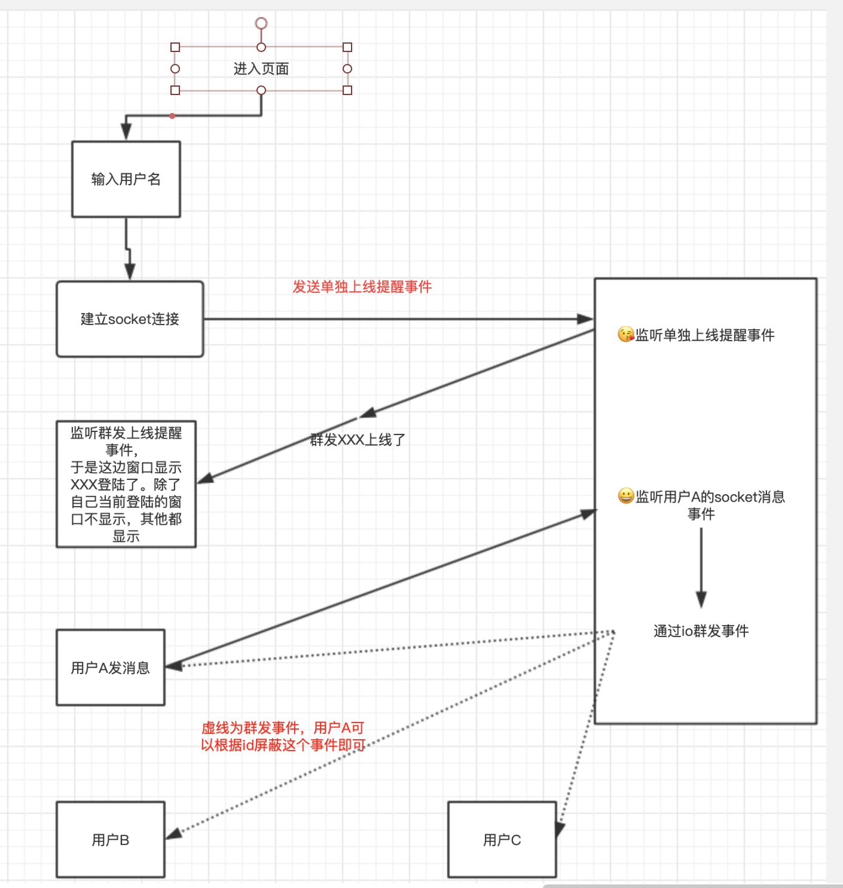

# 基于express + socket.io + jq 的在线聊天室
+ [点击体验](http://106.14.135.233:3002/)
+ 为什么用的还是jq，我借用了我之前[fjd](https://github.com/yuanfang19959/fjd)项目的页面。有点不想重新画样式，这个项目的目的。主要是尝试一下对socket.io的应用吧。 相对来说比直接使用websocket省力好多。
+ 本来想使用react，但是懒得画页面。个人不太喜欢使用jq。
+ 然后之前也在这个项目中说过，等我学习了websokcet再来实现实时通讯吧。现在有时间学了就学好了咯。

## 功能（暂时只有这么多，后面考虑进一步晚上。连接mysql吧）
   + 上线提醒
   + 发送文字
   + 发送图片

## 流程图

## 发送两种方式图片
+ 第一种，发送图片快。缺点两台电脑可能看不到图片。目前正在寻找解决方案
`       
        // 获取图片
        function getObjectURL(file) {
            var url = null;
            if (window.createObjcectURL != undefined) {
                url = window.createOjcectURL(file);
            } else if (window.URL != undefined) {
                url = window.URL.createObjectURL(file);
            } else if (window.webkitURL != undefined) {
                url = window.webkitURL.createObjectURL(file);
            }
            console.log(url);
            return url;
        }

        var file = $(".upload");
        file.change(function () {
            sendMes(1, getObjectURL(file[0].files[0]), userID);
        });
`

+ 第二种，发送图片慢。两台电脑之间可以收到图片，但是慢。我的服务器不是很给力
`       
        var file = document.querySelector(".upload");
        file.onchange = function () {
            Array.from(this.files).forEach(fileItem => {
            var reader = new FileReader();
            reader.readAsDataURL(fileItem);
            reader.onload = function() {
                console.log(fileItem)
                console.log(reader.result)
                sendMes(1, reader.result, userID);
            }
        })
}
`